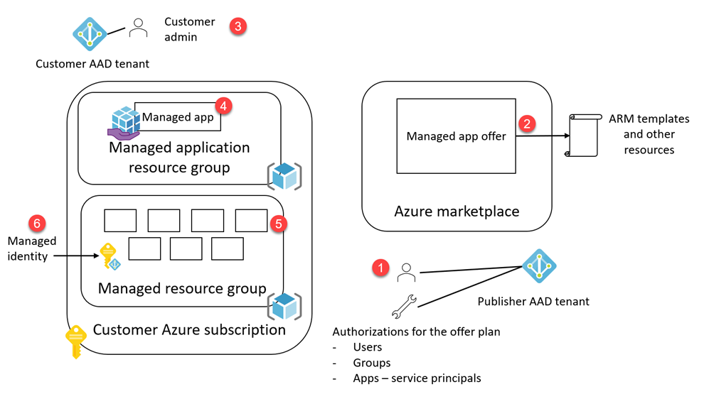
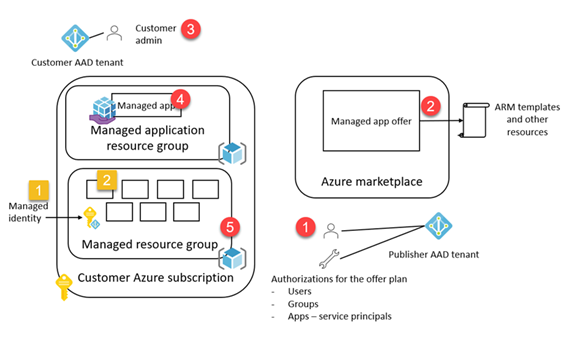
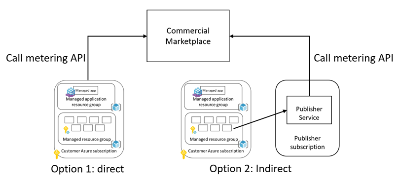
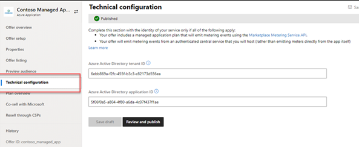
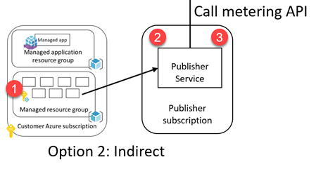
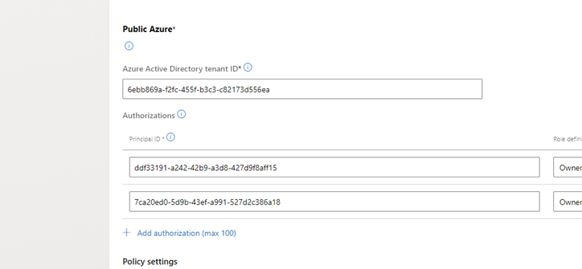

# Posting custom meters for a Commercial Marketplace managed app offer

I have been working with a few teams to help them use managed app offers with custom meters. I would like to consolidate my notes here for the general public's consumption. Usual disclaimer apply, this is sample only, use it at your own risk, understand the concepts throughly before implementing your own. 

What you need to know
- Deploying resources to Azure subscriptions
- Azure Active Directory (AAD) concepts, such as users, groups, application registrations, service principals, authenticating with AAD, and auhorizing access to resources
- Role based access control (RBAC) on Azure
- Managed applications
- Calling marketplace APIs

Here is what we will cover in this article.

- [Posting custom meters for a Commercial Marketplace managed app offer](#posting-custom-meters-for-a-commercial-marketplace-managed-app-offer)
  - [Managed applications overview](#managed-applications-overview)
  - [Posting usage data to Commercial Marketplace using metering APIs](#posting-usage-data-to-commercial-marketplace-using-metering-apis)
  - [What is needed for posting a meter?](#what-is-needed-for-posting-a-meter)
    - [A principal ID on the metering service ACL](#a-principal-id-on-the-metering-service-acl)
    - [Acquire an access token to call metering API](#acquire-an-access-token-to-call-metering-api)
    - [What is this meter request for?](#what-is-this-meter-request-for)
    - [Usage information](#usage-information)
- [Option 1, calling the API directly from a code piece deployed on the managed resource group](#option-1-calling-the-api-directly-from-a-code-piece-deployed-on-the-managed-resource-group)
  - [A principal ID on the metering service ACL](#a-principal-id-on-the-metering-service-acl-1)
  - [Acquire an access token to call metering API](#acquire-an-access-token-to-call-metering-api-1)
  - [What is this meter request for?](#what-is-this-meter-request-for-1)
  - [Usage information](#usage-information-1)
- [Option 2, calling the metering API from a central service](#option-2-calling-the-metering-api-from-a-central-service)
  - [A principal ID on the metering service ACL](#a-principal-id-on-the-metering-service-acl-2)
  - [Acquire an access token to call metering API](#acquire-an-access-token-to-call-metering-api-2)
  - [What is this meter request for?](#what-is-this-meter-request-for-2)
  - [Usage information](#usage-information-2)
- [Accompanying templates](#accompanying-templates)
  - [VM running as user assigned managed identity](#vm-running-as-user-assigned-managed-identity)
  - [VM running as system assigned managed identity](#vm-running-as-system-assigned-managed-identity)
  - [VM running as user assigned managed identity having access to managed app](#vm-running-as-user-assigned-managed-identity-having-access-to-managed-app)

## Managed applications overview

The [Azure documentation for managed applications](https://docs.microsoft.com/en-us/azure/azure-resource-manager/managed-applications/overview) says this:

> Azure managed applications enable you to offer cloud solutions that are easy for consumers to deploy and operate. You implement the infrastructure and provide ongoing support. To make a managed application available to all customers, publish it in the Azure marketplace. To make it available to only users in your organization, publish it to an internal catalog.

Here is how marketplace managed apps work with the default settings.

1. Publisher creates a managed app offer on Partner Center, with at least one plan having assets, as mainTemplate.json, createUIDefinition.json and other resources such as scripts, files, and linked templates. Assigns authorizations for the plan. These can be users, groups and service principals for apps.
2.  Publisher publishes the offer to Azure Marketplace.
3. Customer locates the offer on Azure Marketplace and subscribes to it.
4. This action creates a Managed Application (Azure resource type, **Microsoft.Solutions/applications**) resource in a resource group of customer's choosing.
5. It also creates a managed resource group where the resources defined in the maintemplate.json in step (2) are deployed to.




At the end of this operation, the various identities, such as the customer admin, the ones listed on the authorizations and the managed identity can do the following:

- Identities on the offer plan authorizations list can
  - Be an owner or contributor to the resources in the managed resource group (5)
  - Read the managed app created in (4)
- Customer admin
  - Has the full control on the managed app (4), can delete it, and when he/she deletes it, the managed resource group (5) is also deleted, along with managed resources
   - Has read access to managed resource group (5)

However, if you want to use custom meters, you need some additional moving parts. Marked with yellow square numbers in the diagram below.

1. A managed identity that can access the properties of the managed resource group (step 5) at minimum (and sometimes for the managed app, step 4).
2. Code running in the managed resource group that can
     - Track usage
     - Retrieve the the value to post the usage for (e.g. resource ID of the managed app, or certain properties on the managed app, step 4)



Because we want to send, what was the usage for a dimension, and who used this. Additionally, we also want to make sure the code posting to the metering API can call the API.


## Posting usage data to Commercial Marketplace using metering APIs

You can take two approaches when posting usage using the metering APIs.

1. Post directly by the deployed resources on the customer deployments.
2. Send usage data to your central service you maintain, and post from there.



## What is needed for posting a meter?

When going through those routes, you will need the following.

1. Have a principal ID on the access control list (ACL) of the metering service
2. Get an access token for calling the metering API (the well known resource id "20e940b3-4c77-4b0b-9a53-9e16a1b010a7" - this is different the "Azure" resource ID, it is in the context of APIs protected by Azure Active Directory, welcome to the wonderful world of ambiguous words defining different things!). In order to get this token, the client calling the API needs to get it from Azure Active Directory, using the [OAuth 2.0 client credentials flow](https://docs.microsoft.com/en-us/azure/active-directory/develop/v2-oauth2-client-creds-grant-flow#get-a-token). Please note that this call requires a "scope" parameter, and the value of the scope parameter can be constructed with appending a "/.default" to the resource ID, becoming *20e940b3-4c77-4b0b-9a53-9e16a1b010a7/.default*
3. Who this usage is for (the Managed Application instance of the offer as deployed by the customer)
4. The usage information (i.e. meter dimension, and the value for that meter dimension)

### A principal ID on the metering service ACL

You need to take two different approaches for the principal for those options.

**With Option 1**, you need to have a managed identity deployed to the managed resource group, as part of the ARM template, and the identity should be attached to the resource running the code. Any managed identity deployed as part of the managed application template is on the ACL of the service and can call the metering API.

**With Option 2**, you need to [register an Azure Active Directory](https://docs.microsoft.com/en-us/graph/auth-register-app-v2) application (single tenant, Web App), and add the tenant ID & client ID of the registration on the technical details page of the offer.



### Acquire an access token to call metering API

**With option 1**, you need to [acquire an access token](https://docs.microsoft.com/en-us/azure/active-directory/managed-identities-azure-resources/how-to-use-vm-token) from the Azure Instance Metadata Service (IMDS) for calling the metering API.

**With option 2**, you need to acquire an access token from the Microsoft Identity platform (a.k.a. Azure Active Directory) endpoint. The [documentation](https://docs.microsoft.com/en-us/azure/active-directory/develop/scenario-daemon-overview) has great examples for different programming languages.

### What is this meter request for?

This is the same for both options. You need to grab the information about the managed application deployment instance running your code. This can be in two different values

- *resourceId* property on the API request payload. This value is on the billingDetails property of the managed application (heads up, not the managed resource group, where the resources are deployed). Getting to this value requires an extra step in the ARM template. More to follow.

``` JSON
{
  "resourceId": "ab8923e0-9ac5-b203-7fac-e23fb89de995",
  "quantity": 15.5,
  "dimension": "dim3",
  "effectiveStartTime": "2021-05-05T21:22:03.7651752Z",
  "planId": "gold"
}
```

- *resourceUri* property on the API request payload.

``` JSON
{
  "effectiveStartTime": "2021-05-05T21:22:03.7651752Z",
    "quantity":  15,
    "resourceUri":  "/subscriptions/bf7adf12-c3a8-426c-9976-29f145eba70f/resourceGroups/ercmngd/providers/Microsoft.Solutions/applications/ercmdngd2231",
    "dimension":  "dim1",
    "planId":  "userassigned"
}
```

You can get the resource URI from the managedBy property on the managed resource group (not the managed app). In order to get that, you need to be using a managed identity with a read access to the resource group.

### Usage information

This is the same for both of the options. Since you are already tracking the usage of a particular feature, as represented with a meter dimension on the plan, you need to post this either to the metering API, or the central service, that is, the meter dimension id and the value (amount).

<br/>

# Option 1, calling the API directly from a code piece deployed on the managed resource group

We have mentioned two different options, when using custom meters for managed applications. 

1. Post directly by the deployed resources on the customer deployments.
2. Send usage data to your central service you maintain, and post from there.


Now lets go through the point above for this option. For this, We are going to assume we have a VM in the template, and we are accessing the VM and using PowerShell to call the snippets for demonstrating the concepts. You can translate the same to your programming language of choice.

We have mentioned that you need to have a managed identity on the template before. You can have either a user assigned managed identity, or system assigned managed identity.

## A principal ID on the metering service ACL

1.  Have a [user assigned managed identity](./src/user-assigned-nested/mainTemplate.json#157), or a system assigned managed identity. If you chose to use system assigned managed identity, please see the sample [here](./src/system-assigned/mainTemplate.json#171).
2.  [Assign it to the VM ](./src/user-assigned-nested/mainTemplate.json#171), if you are using system assigned managed identity, see [here](./src/system-assigned/mainTemplate.json#171).
3.  Give [Reader access to the resource group](./src/user-assigned-nested/mainTemplate.json#224)
4.  Set [**delegatedManagedIdentityResourceId** property](./src/user-assigned-nested/mainTemplate.json#234) to make the connection with the managed app.

## Acquire an access token to call metering API

Next step is to acquire an access token. You can get a token with one of the two methods.

1. Use the managed identity provisioned in the template. We will demonstrate this approach below.

2. Use the AAD App registration details on the "Technical details" tab of the offer on Partner Center. You need to pass in the client secret in a safe way to be able to request a token for this app. Please see the [sample](https://github.com/arsenvlad/azure-managed-app-publisher-secret) demonstrating how you can extend a secret from a Key Vault managed by the publisher to another Key Vault deployed as a part of the managed application.

Let's move on to see how you can use the managed identity to request an access token. We need to access the metadata URL for the VM to get this token as follows.

``` PowerShell
    $marketplaceTokenUrl = "http://169.254.169.254/metadata/identity/oauth2/token?api-version=2018-02-01&resource=20e940b3-4c77-4b0b-9a53-9e16a1b010a7"
    $marketplaceToken = Invoke-RestMethod -Headers @{"Metadata" = "true"} -Uri $marketplaceTokenUrl 
```

Notice we are requesting this token for the marketplace API resource with the id **20e940b3-4c77-4b0b-9a53-9e16a1b010a7** see [this document for details ](https://docs.microsoft.com/en-us/azure/marketplace/partner-center-portal/pc-saas-registration#request-body:~:text=Target%20resource%20for%20which%20the%20token,the%20target%20resource%20in%20this%20case.)
And the reason this token will work is because of step (4) above for the ARM template.

## What is this meter request for?

Let's first get the **resourceUri** value. In order to get that, we need to take multiple steps. And the reason we can do this is because we have assigned read access for this managed identity on the managed resource group with the snippet below. It goes without saying that you need to be very careful when you are using managed identites, and RBAC, so you do not expose secrets, and compromise your security. My example below is not a security best practice, but an example on how you can obtain certain values. Assess your risks carefully, and take appropriate action.

```JSON
    {
      "apiVersion": "2020-04-01-preview",
      "name": "[guid(resourceGroup().id)]",
      "type": "Microsoft.Authorization/roleAssignments",
      "dependsOn": [
        "[resourceId('Microsoft.Compute/virtualMachines', variables('vmName'))]"
      ],
      "properties": {
        "roleDefinitionId": "[subscriptionResourceId('Microsoft.Authorization/roleDefinitions', 'acdd72a7-3385-48ef-bd42-f606fba81ae7')]",
        "principalId": "[reference(resourceId('Microsoft.ManagedIdentity/userAssignedIdentities',concat(variables('vmName'), 'ManagedIdentity'))).principalId]",
        "scope": "[resourceGroup().id]",
        "delegatedManagedIdentityResourceId": "[resourceId('Microsoft.ManagedIdentity/userAssignedIdentities', variables('managedIdentityName'))]"  }
    }
```

We will take advantage of the [Azure Instance Metadata Service](https://docs.microsoft.com/en-us/azure/virtual-machines/windows/instance-metadata-service?tabs=windows) from the VM. Please note that if you are running your code in an Azure App, then you have access to the identity using the [ManagedIdentityCredential](https://docs.microsoft.com/en-us/dotnet/api/azure.identity.managedidentitycredential?view=azure-dotnet) class from the Azure Identity library. Then you need to use the Azure SDK to access the resource group etc. One way to access the values of the subscription ID, resource group name etc. is to inject them to the environment variables on the ARM template, and access the environment variables from your code, as there is no equivalent of IMDS on App service.

1. On the VM, grab a token for management API from the metadata endpoint. Notice the resource we are requesting the token for, this time it is https://management.azure.com, the Azure management API

``` PowerShell
    $managementTokenUrl = "http://169.254.169.254/metadata/identity/oauth2/token?api-version=2018-02-01&resource=https%3A%2F%2Fmanagement.azure.com%2F"
    $Token = Invoke-RestMethod -Headers @{"Metadata" = "true"} -Uri $managementTokenUrl 
 ```

2. Call the metadata endpoint to grab the subscription ID and resource group name
  
``` PowerShell
    $metadataUrl = "http://169.254.169.254/metadata/instance?api-version=2019-06-01"
    $metadata = Invoke-RestMethod -Headers @{'Metadata'='true'} -Uri $metadataUrl 
```

3. We will start with getting the resourceUri. We will use the values for subscription ID and resource group name to call management API to get the managed app details. This will give you something like /subscriptions/bf7adf12-c3a8-426c-9976-29f145eba70f/resourceGroups/ercmngd/providers/Microsoft.Solutions/applications/userassigned1112

``` PowerShell
    $Headers = @{}
    $Headers.Add("Authorization","$($Token.token_type) "+ " " + "$($Token.access_token)")

    $managementUrl = "https://management.azure.com/subscriptions/" + $metadata.compute.subscriptionId + "/resourceGroups/" + $metadata.compute.resourceGroupName + "?api-version=2019-10-01"
    $resourceGroupInfo = Invoke-RestMethod -Headers $Headers -Uri $managementUrl 
    $managedappId = $resourceGroupInfo.managedBy 
```

The full source code for using the resourceUri is [here](./src/postingTheMeterUsingResourceUri.ps1).

What if we want to use resourceId instead of resourceUri and also get the plan ID of the offer the managed application? For that case, your managed identity needs to have at least Read permissions on the Managed Application resource itself. You can achieve this by using an incremental deployment in an ARM template. You can find a sample in the ["user-assigned-nested"](./src/user-assigned-nested/mainTemplate.json) directory.

Let's see how it works. Following snippet demonstrates how you can a nested deployment in an ARM template with an embedded template marked with incremental deployment mode.


``` json
  "variables": {
    ....
    "networkSecurityGroupName": "default-NSG",
    "managedApplicationId": "[resourceGroup().managedBy]",
    "managedApplicationName": "[last(split(variables('managedApplicationId'), '/'))]",
    "roleId": "acdd72a7-3385-48ef-bd42-f606fba81ae7"
  },
  ...
    {
      "apiVersion": "2019-04-01-preview",
      "name": "[guid(resourceGroup().id)]",
      "type": "Microsoft.Authorization/roleAssignments",
      "dependsOn": [
        "[resourceId('Microsoft.Compute/virtualMachines', variables('vmName'))]"
      ],
      "properties": {
        "roleDefinitionId": "[subscriptionResourceId('Microsoft.Authorization/roleDefinitions', variables('roleId'))]",
        "principalId": "[reference(concat('Microsoft.ManagedIdentity/userAssignedIdentities/',concat(variables('vmName'), 'ManagedIdentity'))).principalId]",
        "scope": "[resourceGroup().id]",
        "principalType": "ServicePrincipal",
        "delegatedManagedIdentityResourceId": "[resourceId('Microsoft.ManagedIdentity/userAssignedIdentities', concat(variables('vmName'), 'ManagedIdentity'))]"
      }
    },
    {
      "type": "Microsoft.Resources/deployments",
      "apiVersion": "2017-05-10",
      "name": "roleAssignmentNestedTemplate",
      "resourceGroup": "[resourceGroup().name]",
      "properties": {
        "mode": "Incremental",
        "template": {
          "$schema": "https://schema.management.azure.com/schemas/2015-01-01/deploymentTemplate.json#",
          "contentVersion": "1.0.0.0",
          "resources": [
            {
              "type": "Microsoft.Solutions/applications/providers/roleAssignments",
              "apiVersion": "2019-04-01-preview",
              "name": "[concat(variables('managedApplicationName'), '/Microsoft.Authorization/', newGuid())]",
              "properties": {
                "roleDefinitionId": "[concat(subscription().id, '/providers/Microsoft.Authorization/roleDefinitions/', variables('roleId'))]",
                "principalId": "[reference(concat('Microsoft.ManagedIdentity/userAssignedIdentities/',concat(variables('vmName'), 'ManagedIdentity'))).principalId]",
                "delegatedManagedIdentityResourceId": "[resourceId('Microsoft.ManagedIdentity/userAssignedIdentities', concat(variables('vmName'), 'ManagedIdentity'))]",
                "scope": "[variables('managedApplicationId')]",
                "principalType": "ServicePrincipal"
              }
            }
          ]
        }
      },
      "dependsOn": [
        "[concat('Microsoft.Compute/virtualMachines/', variables('vmName'))]"
      ]
    }
```

Once the user assigned managed identity is assigned the appropriate role to the managed application, run the steps 1 through 3 to get an access token as well as the managed application's resource id. Then call the following to get the **resourceUsageId**.

``` PowerShell
$managedAppUrl = "https://management.azure.com" + $managedappId + "\?api-version=2019-07-01"
$managedApp = Invoke-RestMethod -Headers $Headers -Uri $managedAppUrl  

$resourceUsageId = $ManagedApp.properties.billingDetails.resourceUsageId

$planId = $managedApp.plan.name
```

Please see this [sample](./src/user-assigned-nested/mainTemplate.json) for using a nested deployment to assign the appropriate access to the managed application itself to read the resourceUsageId property.

The full source of the PowerShell script is [here](./src/postingTheMeterUsingResourceId.ps1).

## Usage information

We will now build the payload. Notice the trick I am using to make sure I am reporting for this hour only with a 5 minute delay. Notice we are hard coding the plan id here, since we do not have permissions for accessing the properties on the managed app. We can get that if we use the nested deployment method below.

``` PowerShell
    $lastHourMinusFiveMinutes = (Get-Date).AddMinutes(-65).ToString("yyyy-MM-ddTHH:mm:ssZ")

    $body = @{ 'resourceUri' = managedappId; 'quantity' = 15; 'dimension' = 'dim1'; 'effectiveStartTime' = $lastHourMinusFiveMinutes; 'planId' = 'userassigned'} | ConvertTo-Json
```

1. Now let's acquire an access token for calling marketplace APIs
  
``` PowerShell
    $marketplaceTokenUrl = "http://169.254.169.254/metadata/identity/oauth2/token?api-version=2018-02-01&resource=20e940b3-4c77-4b0b-9a53-9e16a1b010a7"
    $marketplaceToken = Invoke-RestMethod -Headers @{"Metadata" = "true"} -Uri $marketplaceTokenUrl
```

2. At this point we have the token to call the metering API with, plus all of the details. But first we need to adjust some details for the service client, since marketplace API implements TLS 1.2.

``` PowerShell
    [Net.ServicePointManager]::SecurityProtocol = [Net.SecurityProtocolType]::Tls11, [Net.SecurityProtocolType]::Tls12;
```

3. And post the meter, notice the content type header.
  
``` PowerShell
    $Headers = @{}
    $Headers.Add("Authorization","$($marketplaceToken.token_type) "+ " " + "$($marketplaceToken.access_token)")

    $response = Invoke-RestMethod 'https://marketplaceapi.microsoft.com/api/usageEvent?api-version=2018-08-31' -Method 'POST' -ContentType "application/json" -Headers $Headers -Body $body -Verbose
```


# Option 2, calling the metering API from a central service

Let's revisit the items you need for posting a meter once more.

1. Have a principal ID on the access control list (ACL) of the metering service
2. Get an access token for calling the metering API (the well known resource id "20e940b3-4c77-4b0b-9a53-9e16a1b010a7" - this is different the "Azure" resource ID, it is in the context of APIs protected by Azure Active Directory, welcome to the wonderful world of ambiguous words defining different things!). In order to get this token, the client calling the API needs to get it from Azure Active Directory, using the [OAuth 2.0 client credentials flow](https://docs.microsoft.com/en-us/azure/active-directory/develop/v2-oauth2-client-creds-grant-flow#get-a-token). Please note that this call requires a "scope" parameter, and the value of the scope parameter can be constructed with appending a "/.default" to the resource ID, becoming *20e940b3-4c77-4b0b-9a53-9e16a1b010a7/.default*
3. Who this usage is for (the Managed Application instance of the offer as deployed by the customer)
4. The usage information (i.e. meter dimension, and the value for that meter dimension)

And go through them for Option 2, calling an intermediate service publisher exposes to post the meters back to the metering API.



## A principal ID on the metering service ACL

We will be using a central service to call the metering API. In order to do that, we will use a [Microsoft Indentity Service app registration](https://docs.microsoft.com/en-us/graph/auth-register-app-v2) (a.k.a. Azure Active Directory app registration).

You will need to then add the tenant ID & client ID of the registration on the technical details page of the offer.


## Acquire an access token to call metering API

Use the AAD App registration details on the "Technical details" tab of the offer on Partner Center. You need to pass in the client secret in a safe way to be able to request a token for this app. Please see the [sample](https://github.com/arsenvlad/azure-managed-app-publisher-secret) demonstrating how you can extend a secret from a Key Vault managed by the publisher to another Key Vault deployed as a part of the managed application.

Alternatively, you can use one of the client libraries [here](https://github.com/microsoft/commercial-marketplace-samples#clients-for-fulfillment-and-metering-apis).

## What is this meter request for?

You can take one of the two methods for getting this.

1. Get all of the information from the deployment directly. This is the same method as Option 1. You need to have a managed identity, that can access the managed resource group properties, or the **billingProperties** property of the managed application.
2. Configure an AAD App registration and add it to the Authorizations list of the plan, with at least contributor level access. Get partial information from the deployment, with the Azure subscription Id, and the resource group. Use the configured AAD App to call Azure management API to get the "managedBy" property on the managed resource group and use resourceURI parameter to post the meter.
  
First method is covered in Option 1 discussion. Let's look at how the second method works.

I am assuming you already have a published (or in preview) managed app that has at least one VM in it, with RBAC configured so the managed identity it is running under has access to the managed resource group. [Please see this as an example](https://github.com/Ercenk/marketplacemanagedappwithmeters/blob/master/artifacts/user-assigned/mainTemplate.json#L250). 

I am also assuming you have an AD group ID added to the authorizations list on your offer's plan's technical configuration page.

1. Make a new app registration on Azure AD to eventually call the management APIs.

```
    az ad app create --display-name "ErcAppManager"
```    

    Get the id of the registered app with 

```    
    az ad sp list --query "[?displayName=='ErcManagedApp2'].{appId:appId}"
```    

For example the above command returns the following
```
    [
        {
            "appId": "74a5e576-bf02-4a23-add8-a031c5820b14"
        }
    ]
```

Also get the objectId of the service principal with the following

```
    az ad sp list --query "[?displayName=='ErcManagedApp2'].{objectId:objectId}"
```

It should return something like this
```
    [
        {
            "objectId": "7ca20ed0-5d9b-43ef-a991-527d2c386a18"
        }
    ]
```

2. Add the app registration to the AD group recorded in the authorizations list, alternatively, find the service principal for the app registration on "Enterprise applications" list on your directory, and add the object ID of the SP to the authorizations list.



3. Now we will simulate an application calling Azure Management API to access the managed app
4. Go to Azure Portal, Azure Active Directory blade, find your newly created app registration, click on Certificates & secrets and add a secret. Copy the secret, you will not be able to access it again.
4. Open a command line, and type in the following 
    4.1 Request an access token
```
        curl -X POST -d 'grant_type=client_credentials&client_id=[APP_ID]&client_secret=[PASSWORD]&resource=https%3A%2F%2Fmanagement.azure.com%2F' https://login.microsoftonline.com/[TENANT_ID]/oauth2/token
```    

Now copy the value of the return access_token, and insert into the following cUrl call. We are assuming your code in the deployed VM will be providing the subscription 

```
    curl -X GET -H "Authorization: Bearer [TOKEN]" -H "Content-Type: application/json" https://management.azure.com/subscriptions/[SUBSCRIPTION_ID]//resourceGroups/[RESOURCEGROUPFORTHEMANAGEDAPP]/providers/Microsoft.Solutions/applications/[MANAGEDAPPNAME]?api-version=2019-07-01 | jq
```

This should return the  **billingDetails** property with **resourceUsageId**.

## Usage information

This information is posted by the deployment to your service's endpoint. We are not getting into the implementation details for this service or how to secure that since it is out of scope for this discussion. Assuming that the service receives this information, along with who this usage is for, next is to call the metering API either directly, or using one of the [clients](https://github.com/microsoft/commercial-marketplace-samples#clients-for-fulfillment-and-metering-apis) to post the usage.

# Accompanying templates

There are three different templates with slightly varying structures to support the examples above. They demonstrate how the different approaches above can be used.
   - system-assigned: Used for all approaches except getting resourceUsageId from the billingDetails of the managed application
   - user-assigned: Used for all approaches except getting resourceUsageId from the billingDetails of the managed application
   - user-assigned-nested: Demonstrates how permissions can be set for getting resourceUsageId from the billingDetails of the managed application


The templates set either a user assigned managed identity or a system assigned managed identity to the VM.


1. Storage account as a diagnostics store for the VM
2. Public IP address for the VM
3. A network security group 
4. Virtual network
5. Network interface card
6. Virtual machine - approaches for identity are different in the samples
7. Role assignment - varies by approach
   
## VM running as user assigned managed identity
The template defines a user assigned managed identity resource (of type 'Microsoft.ManagedIdentity/userAssignedIdentities').

The VM runs under this managed identity. This identity assumes the reader role for the managed resource group and specifies the cross tenant access though '**delegatedManagedIdentityResourceId**' property.

We are setting the **delegatedManagedIdentityResourceId** to access the managed application's ID through the managed resource group's '**managedBy**'. That property needs a resource Id, and user assigned managed identity is a resource, so getting the resource ID is easy. Also notice how the principalId for this resource is set, we are accessing the user defined managed identity resource, and getting the principalId.

## VM running as system assigned managed identity

The VM runs under a system assigned managed identity. This identity assumes the reader role for the managed resource group and specifies the cross tenant access though '**delegatedManagedIdentityResourceId**' property. Notice how the principalId is set. This time the principalId is on the VM resource. Also, the value for the delegatedManagedIdentityResourceId property is slightly different, we are accessing the VM's resource ID.

We are setting the **delegatedManagedIdentityResourceId** to access the managed application's ID through the managed resource group's '**managedBy**'. That property needs a resource Id, and user assigned managed identity is a resource, so getting the resource ID is easy.


## VM running as user assigned managed identity having access to managed app

The template defines a user assigned managed identity resource (of type 'Microsoft.ManagedIdentity/userAssignedIdentities').

The VM runs under this managed identity. This identity assumes the reader role for the managed resource group and specifies the cross tenant access though '**delegatedManagedIdentityResourceId**' property.

The template then defines a nested template to be run after this deployment complete. Important note is to use 'incremental' mode on this template. The template defines a role assignment resource that assigns the reader role for the user assigned managed identity to the managed application created in the main template. Please notice the 'scope' property for the role assignment.

The additional nested template named 'outputsForDeployent' is used for debugging.
