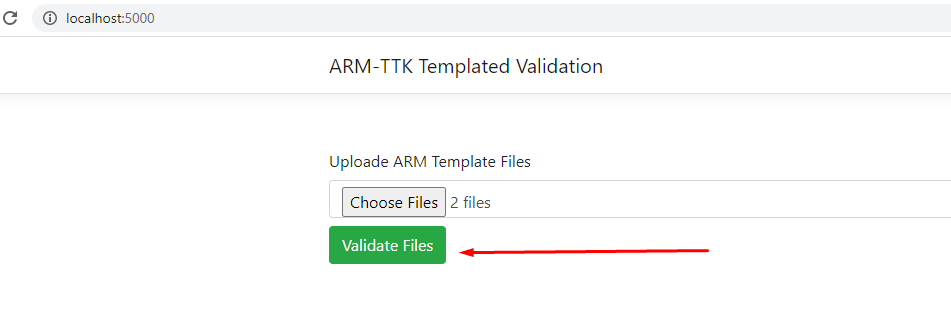
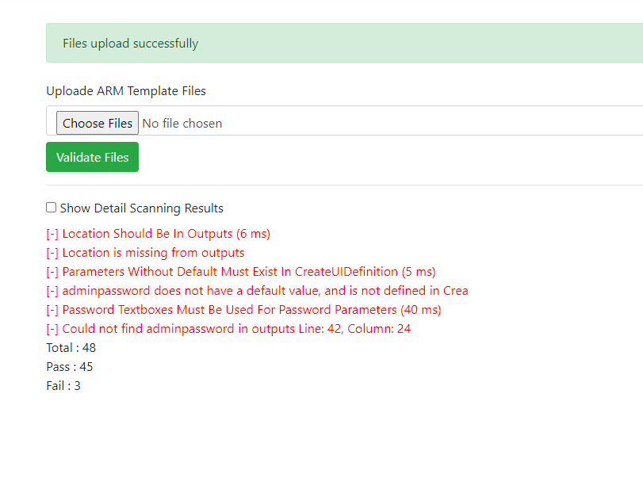
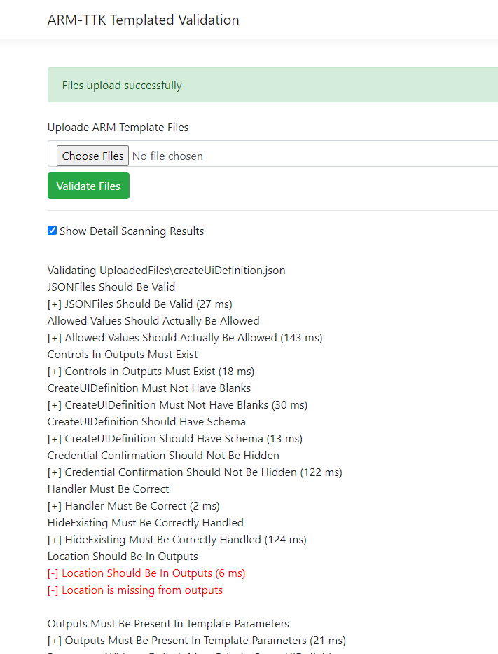

# ARM TTK  Web APP Validation

This repo is a demostration on HOW-TO use dotnet core web app to validate an ARM Template using Azure [ARM Toolkit](https://github.com/Azure/arm-ttk).

## How to build the code
The code using docker file to create a docker image to run the webapp.

```
git clone https://github.com/msalemcode/arm-ttk-web
cd arm-ttk-web
docker build -t arm-ttk-web:v1 .
```

## How to run the ARM TTK WebApp

Once the container is build, you can run the app locally using the following command

```
docker run -it --rm -p5000:80 arm-ttk-web:v1
```
Now you can access the webapp at http://localhost:5000

## How to Validate an ARM Template
1. Once the image is running go to http://localhost:5000
2. Upload ARM Template(s)

3. Click Validate and the Summary result will show as following

4. Click **Show Detail Scanning Results** to show scan detail



## Download built-in image
You can download a ready built-in image as following
```
docker pull magdysalem/armttkweb:v1
```