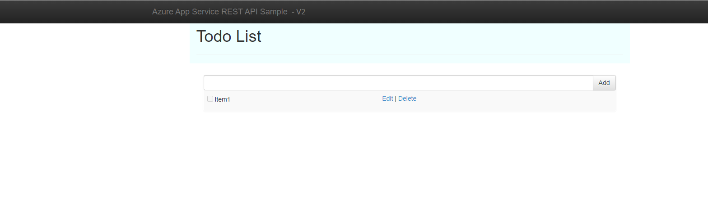

# Azure Managed App CI/CD Demo
The goal of this demo is to demonstrate how to build azure pipeline to update azure managed application artifacts in customer environment.

# Requirements
The demo requirement is to have the knowledge of 
1. [Create and publish managed app](https://docs.microsoft.com/en-us/azure/marketplace/azure-app-offer-setup)
1. [Azure pipeline](https://docs.microsoft.com/en-us/azure/devops/pipelines/get-started/what-is-azure-pipelines?view=azure-devops)

# Learning Resources
It is highly recommended to review the following material before starting this demo
1. [Managed Applications for the Microsoft Marketplace - Workshop](https://aka.ms/AMAWorkshop)
1. [Customize your pipeline](https://docs.microsoft.com/en-us/azure/devops/pipelines/customize-pipeline?view=azure-devops)
1. [Create Azure AD App Registration](https://docs.microsoft.com/en-us/azure/active-directory/develop/howto-create-service-principal-portal)
# Prerequisites
Before using the demo, the following components should exist:
1. Azure managed app offer with at least one plan
1. AAD App Registration
> [!NOTE]
> AAD App Registration will be used as part of the managed app plan technical configuration and also as part of Azure pipeline 

## Publish the managed app demo
1. Find `amav1.zip` under `arm folder` and upload it to managed app plan technical configuration

1. Use AAD App Registration  `Client ID` to relocate its corresponding `Enterprise App`

1. Locate the `Object ID` for the `Enterprise App`

1. Enter the `objbect ID` and `AAD tenant ID`

1. Save Draft 
1. Review and publish

## Deploy published managed app
> [!NOTE]
> It is highly recommended to use a **different tenant** for deployment to demonstrate customer environment
1. Deploy the managed app from marketplace, please refer to this [link](https://docs.microsoft.com/en-us/marketplace/purchase-azure-app-in-azure-portal#purchase-an-azure-application-using-the-marketplace-experience) 
1. Access the managed resource group, open the webapp url under App Service and you should see the following webpage

## Deploy modified Artifact to managed app
1. Modify the web application source code, add extra header line or change logo
1. Establish Azure pipeline using Azure-pipline.yaml file, please refer to this article as a guide [HOW-TO Establish Pipeline](https://docs.microsoft.com/en-us/azure/devops/pipelines/customize-pipeline?view=azure-devops)

1. Add a variable group to azure library `amaSecrets` and add AAD app registration client ID, client secret ID and tenant ID. Please refer to this article [HOW-TO add variable Group](https://docs.microsoft.com/en-us/azure/devops/pipelines/library/variable-groups?view=azure-devops&tabs=yaml)

1. Add new environment and call it UpdateManagedApp
1. Add yourself or other AAD User as Approval for the environment, please refer to this articale [HOW-TO Create pipeline Environment](https://docs.microsoft.com/en-us/azure/devops/pipelines/process/environments?view=azure-devops) 

1. Run pipeline
1. After it finishes, access managed app webapp and confirm it was updated

As you see the managed app reflects the new site version

